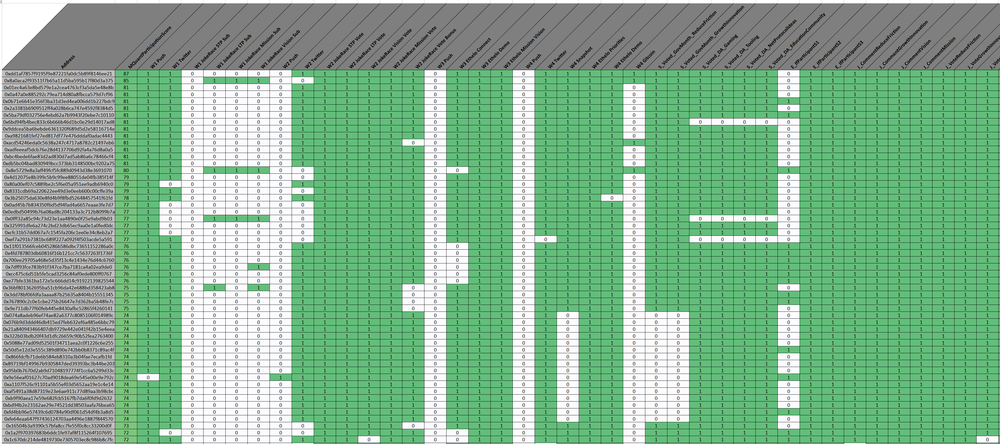
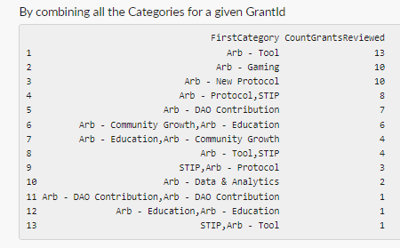

# Arbitrum-Firestarter-Analysis
Arbitrum Firestarter Analysis

**OmniAnalytics Firestarter Grantee Report Overview**

The Firestarter grant given by Plurality Labs on behalf of the Arbitrum DAO to Omni Analytics Group has enabled the team to support a wide variety of Milestone 1 related data initiatives. From pulling contest data directly from the blockchain for the JokeRace team during GovMonth to ranking eco-system activity, we’ve been able to generate and share insights that help the DAO track governance participation, understand trends in user sentiment and ultimately act in ways that encourage further governance adoption. This post will walk through the Objectives, activities, tasks and outputs from our analysis of Arbitrum DAO governance month data as the analytical “Firestarters” for the DAO.

**High Level Objectives:**

- Understand how engaged the Arbitrum community was in generating Vision, Mission, Short-term and Long-term Priorities. 

- Uncover meaningful patterns and insights about a) submissions and b) community involvement.

- Demonstrate and share effective methods of analyzing data for future use.

**Funding / Timeline:** 65,399 $ARB / September 10th, 2023  - January 1st, 2024

**PROJECT 1: Analyze Jokerace submissions for Vision, Mission, Short-term and Long-term priorities**

**Objective:**

- Analyze the Jokerace submissions across four contests, Vision, Mission, Short-term priorities and Long-term priorities.

- Develop a method to identify valid wallet submissions and evaluate contribution quality.

- Uncover meaningful patterns and and share insights regarding 1) submitted contributions and b) community involvement.

- Share effective methods for analyzing data for future use with the community.

- Share resulting data and data analysis on an agreed upon public hub.

**Timeline:** September - October 2024

**Activities:**

- Write code to extract responses directly from the blockchain.

- Performed extensive data cleaning and text pre-processing in preparation for further analysis.

- Conducted text analysis on the responses using the following techniques:

  - n-gram extraction

  - POS tagging and frequency analysis

  - Topic analysis using Latent Dirichlet Allocation

  - Topic summarization and information condensing with Chat-GPT

- Drafted a 3 page summary document continuing the common themes and stand out responses for each topic of inquiry.

**Outputs:** 

- Raw Jokerace data stored as a .csv for easy sharing and transparency.

- Processed Jokerace data stored as a .csv for reproducibility and further analysis.

- A summary of procedures, insights, and learnings from the data.

**Outcomes:** 

1. Leveraged AI-fueled analysis to uncover meaningful themes that emerged from the community.

2. Used these themes  to solicit refined community  input into the Thank ARB strategic framework via  three more rounds of community input (overall strategic framework feedback via Ethelo , voting on strategic priorities via Snapshot, perception of each program in delivering on strategic priorities via Ethelo)

**Analysis Snippet:**

- Introduction

Plurality Labs, founded by @Disruption Joe and supported by his teammates @prose11 | GovAlpha and @radioflyerMQ were given the task to setup experimental governance mechanisms that would allow for formalized "sense-making" that will help the DAO come up with a strong mission and vision to guide their decisions as they then follow up with initiating the capital allocation process where grants will be given out to support the ARB ecosystem.

- Write code to extract responses directly from the blockchain.

One of those experiments was an online incentivized survey hosted by "JokeRace" as part of the ThanksARB initiative of Arbitrums "#GOVMonth". The Jokeraces consisted of 4 separate on-chain surveys where users were prompted to provide feedback on:

ArbitrumDAO Short-term Strategic Priorities (Reduce Friction) - 0xbf47BDA4b172daf321148197700cBED04dbe0D58

ArbitrumDAO Long-term Strategic Priorities (Growth and Innovation) - 0x5D4e25fA847430Bf1974637f5bA8CB09D0B94ec7

ArbitrumDAO Northstar Strategic Framework: Vision - 0x0d4C05e4BaE5eE625aADC35479Cc0b140DDF95D4

ArbitrumDAO Northstar Strategic Framework: Mission - 0x5a207fA8e1136303Fd5232E200Ca30042c45c3B6

- Performed extensive data cleaning and text pre-processing in preparation for further analysis.

Using some standard data science wizardry, we were able to procure the responses directly from the chain through some clever Dune Dashboard querying.  Afterward, we were able to procure a dataset that had the information relevant from the jokerace:

**BlockTime** - When the Submission hit the blockchain

**Contract** - Which Jokerace was this submission for

**Address** - The Wallet address of the submittor 

**Slug** - an ID

**URL** - URL of the Submission

**IsImage** - Whether it had an image

**Content** - The Text submission

The data was then cleaned by removing HTML tags, stem words, duplicates and filtering out low quality submissions. We’ll gloss over the effort required to filter out “low quality submissions”, but it involved using regex and grade level calculations to automatically root out submissions that were clearly uninformative.

 

Our text analysis returned a bottom up view of contributor responses by processing all 19,992 individual free form written responses into insights used by the Plurality team to generate their “Strategic Framework” document to the DAO. 

- Conducted text analysis on the responses using the following techniques:

n-gram analysis

 

Parts of speech tagging

 

Topic Analysis with LDA

 

- Drafted a 3 page summary document continuing the common themes and stand out responses for each topic of inquiry.

 

- Conclusion

We also offered suggestions on how to restructure future JokeRaces based on learnined from the data cleaning process. There needs to be some modifications to the prompting of the next Jokerace to get useful results.  Here are some of our thoughts:

Asking for keywords: "Give us 5 key words of phrases that describe what our mission or vision should be".  This will at least make it easy for us to to a frequency analysis to get the most commonly used words and can directly correlate that with intent. Then, we can also look for unique words, which could be informative even if we get tons of duplicate spam submissions.

The prompting "Start your entry with: "Arbitrum DAO's Vision is”" and Start your entry with: ""Arbitrum DAO's Mission is”"were great as both guidance and to weed out the obvious duplicates, spam submissions and chatgpt responses.  The ChatGPT spam is prevalent and after reading comment after comment it became a bit obvous which ones used chatGPT with default prompting.  They just blindly listed suggestions that are blockchain relevant but not necessary Arbitrum specific.

The voting absolutely didn't work AT ALL. There was very little voting and those that did vote were clearly trying to game the system.  It could be useful if we investigated the submissions and the voters to see if they have a history of sybil attacks.  It could make for the start of a shadow ban list.

**PROJECT 2: Analyze Jokerace and Ethelo submissions for strategic framework (Vision, Mission, Short-term and Long-term priorities) together.**

**Objective:**

- Filter content gathered via Jokerace contests to eliminate submissions by bots, etc and ensure only meaningful contributions topics are brought forward to Ethelo surveys to help the community converge on options.

- Help the Plurality Labs team look beyond the most popular entries to identify the most relevant themes emerging from all strategic framework entries on Jokerace.

- Demonstrate and share effective and scalable  methods of validating and analyzing voting data and long-form content for future use.

* Share resulting data and data analysis on an agreed upon public hub.

**Timeline:** September - October 2023

**Activities:** 

- Data procurement from both Jokerace and Ethelo

- Guided consulting centered around the interpretation of the Ethelo and Jokerace findings

**Outputs:** 

- A series of meetings explaining the statistical implications of the data on how they related to sense making the Vision and Mission.

**Outcomes:** 

- Generated a Strategic Framework (Mission, Vision, Values and Funding Priorities) that was sourced and vetted by the community.

- Learned that we should have targeted delegate input specifically, rather than relying on a general call for DAO community input. Over time began to establish a delegate specific engagement strategy and reward system.

- Initially we believed the crowdsourced results were sufficient to move forward with the strategic framework but overtime, we learned that we should have ratified the results more formally with a snapshot vote.

**PROJECT 3: Analyze Snapshot rankings Short-term and Long-term priorities**

**Objective:**

- Help Plurality Labs and the Arbitrum DAO compare results when exploring the same strategic framework questions on Ethelo and Snapshot to determine the best channel for quality input.

- Explore contributions by known delegate wallets and general contributor wallets to determined similarities and difference in priorities 

- Share effective data analysis to enable the Plurality Labs team to refine the strategic framework.

- Share resulting data and data analysis on an agreed upon public hub.

**Timeline:** October - November 2023

**Activities:**

- Procure the aggregate Snapshot data. 

- Process the data into a format suitable for analysis.

- Generate and calculate additional features from the raw data.

- Develop a robust ranking scheme that allows for the inclusion of token weighted votes.

- Analyze and compare the rankings of the various statements when votes are both equally weighted and weighted by token holdings.

**Outputs:**

- Raw and processed data with ranked statements for all wallet addresses that participated in the sense making exercise.

- Structured rankings of each statement, in table format, accounting for equal and token weighted voting schemes.

**Outcomes:**

- Prioritized the full set of MIssion and Visions statements and quantitatively showed alignment between large token holders and the greater community by comparing the token weighted and unweighted results.

- Learned that when validating Strategic Priorities  Snapshot vs. Ethelo generated more contributions and a more refined view of participating wallet activity.

- Used analysis of results in final Gov Month report sharing a Thank ARB strategic framework (Vision, Mission, Values and Strategic priorities) designed to guide funding decisions.

**Analysis Snipped:**

- Procure the aggregate Snapshot data. 

 

Another component of governance sense making contributors participated in during #GovMonth was an option ranking poll hosted by Snapshot.org.  For this task, voters were prompted with two sets of statements related to “Growth and Innovation” and ways Arbitrum could “Reduce Friction”.  The survey respondents were to rank order each statement according to their personal preference. The statements for each are as follows:

. 

Growth + Innovation- 

1. Develop accountability practices within ArbitrumDAO.

2. Identify the key capabilities that will lead to improved DAO performance.

3. Form alliances with legacy institutions to boost our growth.

4. Fund projects to enhance cross-chain compatibility.

5. Improve gas fee optimization.

6. Define growth strategies.

7. Incentivize users and builders to come to Arbitrum.

8. Scale of the platform.

9. Offer educational opportunities to build the community.

10. Evolve governance capabilities.

Reducing Friction- 

1. Build a robust community of developers in ArbitrumDAO.

2. Make Arbitrum more accessible and easier to use for developers

3. Create an inclusive environment for our community.

4. Encourage meaningful participation in the DAO activities

5. Raise awareness about the opportunities on Arbitrum

6. Prioritize Gas fee optimization.

7. Ensure regulatory compliance.

8. Build out anti-Sybil protections.

9. Uphold transparency in both project and governance development.

10. Improve the equity of token distribution.

This generated data in the following form where each column was an individual wallet address identified respondent and the columns indicated information about that wallet and their ultimate choice ranking of the individual statements. 

With this data as a guide, we then took the initiative to perform a proper scrape of the underlying votes within the snapshot.  This data took the following form:\

 

In this form, we had not only the wallet address and its ordering of statements, but also the total amount of Arbitrum held which affected the weighted rank of the statements voted on.  With that it was only a matter of summing up the rankings while also successfully accounting for the voting power.

- Generate and calculate additional features from the raw data.

This culminated into a dataset with the following columns:

**Proposal**    - URL of the ARB Snapshot

**ProposalText**    - Text Title of the ARB Snapshot

**Choice**    - ID of the GovMonth Statement of interest

**ChoiceText**     - Text of the GovMonth Statement of interest

**SumRank**     -  A simple summation of the Voter Ranking of that Statement (Lower is Better)

**SumRankAvg**    - The average rank of the of that Statement (Lower is Better)

**PctFirst**    -  Proportion of times that statement was ranked 1st (Higher is Better)

**PctLast**     - Proportion of times that statement was ranked 10th / Last (Lower is Better)

**PctFirstFive**    - Proportion of times that statement was ranked in the top 50% (Higher is Better)

**VPRankAvg**    - The unscaled rank of the of that Statement (Lower is Better)

**VPRankAvgScaled** - The average scaled rank of the of that Statement (Lower is Better)

- Process the data into a format suitable for analysis.

- Develop a robust ranking scheme that allows for the inclusion of token weighted votes.

To ease the process of interpretations We've used conditional formatting to color code the values according to the scale so that green values are better than red.  This makes it easier to see which statements scored well overall and in direct comparison to others.

- Analyze and compare the rankings of the various statements when votes are both equally weighted and weighted by token holdings.

If we simply sort by the "SumAvgRank" column, we get the following image:

 

We see that for the "Reducting Friction" Snapshot, the "Prioritize Gas Fee optimization" was the highest ranking statement when we weight every voter equally.  This statement also appears to have been ranked 1st the most of other statements, was ranked last the least number of times and was ranked in the top 50%, 72% of the time.

To see the change in results when accounting for voting power you can simply re-sort the sheet by the last 2 columns.

Likewise, the second most supported statement was "Build a robust community of developers in ArbitrumDAO." which had solid stats, but actually ras ranked in last place 10% of the time, the 4th highest of all other statements.

Again, to see the change in results when accounting for voting power you can simply re-sort the sheet by the last 2 columns.

When doing so, you get the follow image for "Reducing Friction"

In general, the ordering is similar, but at the top the previous number 2 statement "Build a robust community of developers in ArbitrumDAO." becomes the most supported statement. When accounting for voting power, a new second place statement arises "Raise awareness about the opportunities on Arbitrum". Together, it becomes apparent that the community places a heavy emphasis on building out the developer community and letting the greater web3 community know that there are big opportunities to build on Arbitrum.

**PROJECT 4: Analyze all Gov Month contributions to uncover engagement patterns and inform Thank ARB persona development**

**Objective:**

- Inform the development of behavioral based Arbitrum user profiles/archetypes.

- Identify which wallets had most consistent and meaningful participation in GovMonth based on weighted analysis contribution types and engagement. 

- Provide directional data analysis to help Plurality Labs better measure, monitor and reward quality contributions and improve Monthly Active Users (MAU).

- Demonstrate and share effective methods of analyzing data for future use.

**Timeline**: October - December 2023

**Activities**:

- Aggregated all #GovMonth data into a singular spreadsheet.

- Processed the columns to create a suitable analysis table where each row is a wallet address and each column indicates participation in that specific initiative.

- Expert knowledge was leveraged to generate weights for each task.

- A simple dot product was taken across the participation matrix and scoring vector to produce participation scores for each wallet that interacted with Arbitrum through #GovMonth.

- Perform a preliminary investigation of how user defined segments participated.

**Outcomes:**

1. First pass at a prototype methodology intended to identify, devince and ultimately leverage participant archetypes and personas.

2. Shared data with the Thank ARB team to inform improved engagement and communication strategies. 

3. Established a baseline approach to MAU and engagement metrics that can be leveraged in Milestone 2 and 3.

**Analysis Snippet:** 

One of the mandates of the Plurality Labs mandate is to experiment with innovative governance mechanisms that draw out different voices from across the Arbitrum eco-system.  One such experiment has revolved around the creation of trust contributor allow lists which leverage past participation in order to identify and surface the efforts of dedicated Abitrum citizens. To do so we aggregated all of the data across the entire #GovMonth effort; which included snapshot votes, ethelo surveys, jokerace responses, social media amplifications and other eco-system beneficial actions. This meta-dataset housed a total of 75,201 addresses whom performed at least one of the 36 trackable actions. Using domain knowledge from the Plurality Labs team, we utilized a simple dot product to combine the participant’s action matrix with a weighted score of each activity.  This culminated into a “MQuantParticipationScore” that we then used to sort and find active citizens. In addition to identifying active Govmonth participants, we were able to notice that none of the larger known delegates participated in the sense making governance exercise, which opens up an opportunity for additional engagement with some of the protocol stewards in future governance initiatives. 

 

 

- Aggregated all #GovMonth data into a singular spreadsheet.

 

- Processed the columns to create a suitable analysis table where each row is a wallet address and each column indicates participation in that specific initiative.

 

- Expert knowledge was leveraged to generate weights for each task.

 

- A simple dot product was taken across the participation matrix and scoring vector to produce participation scores for each wallet that interacted with Arbitrum through #GovMonth.

 

- Perform a preliminary investigation of how user defined segments participated.

 

 

This dataset also allowed us to begin thinking through allow lists and potential segmentations, but these aren’t the narrowed groups we’re ultimately looking for. The data we have now isn't super rich, but it probably suggests that you can't put a fixed time on contributions ... aka calling it "gov month" because people will start hot, slack off during the middle, and then finish strong....we see that in the data already with week 1 and week 4 being the highest. But for the purposes of scoring, yep those with the longest steaks are the ones that participated in the most events and therefore have a higher ranking. We see this from the graph below where Week 1 had 13,070 participants, Week 2 had 3,548, Week 3 had 1,585, and Week 4 had 6,750.

 

**PROJECT 5: Karma Program and Engagement Analysis**

**Objective:**

- Understand how engaged the Arbitrum community was in reviewing grant programs. Uncover meaningful patterns and insights about a) grants and b) community involvement.

- Demonstrate and share effective methods of analyzing data for future use.

- Share resulting data and data analysis on agreed upon public hub.

**Timeline**: February 2024

**Activities**: 

- Collect Plurality Labs milestone 1 grantee data

- Perform data manipulation and data cleaning

- Calculate distributions and summary statistics to answer the questions of inquiry

**Outputs:** 

- Number of grants reviewed.

- Top 10 grants reviewed.

- How many profiles were updated.

- Number of reviewers. 

- Average number of grant reviews by qualifying wallets.

- Top 10 qualifying wallets by number of grants reviewed.

- How many reviews by category.

**Outcomes:**  

1. The analytics were absorbed by the PL team and used as initial KPIs for grantee tracking.

2. KPIs listed here were expanded and informed the design on a grantee tracking dashboard.

**Analysis Snippet:**  

- Collect Plurality Labs milestone 1 grantee data

 

 

- Perform data manipulation and data cleaning

Some grants were assigned multiple categories, other grants had multiple GrantIDs and, according to the data, two grants had the same title.  We accounted for this in the data munging portion.

 

 

1. Number of grants reviewed

70

2. Top 10 grants reviewed

 

3. Number of reviewers (unique public addresses)

2525

4. Average number of reviews per wallet

<!---->

    Min. 1st Qu.  Median    Mean 3rd Qu.    Max. 
      1.000   1.000   2.000   2.037   3.000  32.000 

Median and mean number of reviews per reviewer is 2.

5. Top reviewers

 

6. Number of Reviews by category

 

7. Number of Reviews by second category

 

8. Number of reviews combining all categories

 

**PROJECT 6: Contributor “Capture Rate” Analysis**

**Objective:**

- Help Plurality Labs and Arbitrum DAO understand the percentage of contributions initiated via  and rewarded via Thank ARB during Milestone 1.

- Establish a baseline to compare performance and practices between the Milestone 1, 2 and 3.

**Activities**: 

- Leverage the #GovMonth Meta-Analysis Data to calculate participation rates for the various initiatives.

**Outputs:** 

- A data frame with each ThankARB activity and the number of participants as a proportion of the total with and without sampling corrections.

**Outcomes:** 

1. We were able to identify which contribution offered during GovMonth  invited the most participation. 

2. Identified internal and external channels and communication strategies to improve overall Monthly Active Users (MAU).

3. Laid a baseline foundation for future comparison / learning. 

**Timeline**: February 2024

**Analysis Snippet:**  

- A data frame with each ThankARB activity and the number of participants as a proportion of the total with and without sampling corrections.

According to our ThankARB / GovMonth data there are 75,201 unique wallet addresses that participated in at least one activity. Out of those there are 57,957 users which participated in ONLY Snapshot. We can't be certain there weren't a large number of bots or sybils so we included calculations with and without those Snapshot users. After removing those wallet addresses, there are only 17,244 users left. We calculated another set of proportions using that subset.

\`**ActivityPropAllUsers**\` is all users including snapshot only users 

\`**ActivityPropCorrectUsers**\` is all users not including only snapshot users.

 

A direct interpretation of the first row is: 13.9% of all of the wallets in the dataset participated in the Week1 Push according to ActivityPropAllUsers but using the ActivityPropCorrectUsers column (which is corrected by removing the snapshot only voters) 61% of the wallet addresses participated in that activity.

**Conclusion and Lagniappe**

Because of this opportunity as a Firestarter grantee we’ve been able to not only learn more about Arbitrum but participate in various opportunities both within and outside the data science realm.  The spirit of innovation and experimentation is ripe within Arbitrum and that makes it a great home for teams to express and even try to engage with others in ways that are interesting but maybe outside of their comfort zone.  As a result of our Firestarter engagement we’ve also:

- Participated in the Allo x Gitcoin hackathon with 3 submissions: a data extractor, dashboard and gamified Gitcoin allocation mechanism for Arbitrum hosted grants.Created an R package that makes it easier to pull data on arbitrum hosted rounds on gitcoin.  This work will be one of the submissions to the Allo x Arbitrum hackathon

 

- Our community developed a speed-run game Omniacs.Run! now has Arbitrum related content. We intend to further interweave Arbitrum branding and content as we develop the game.

 

- Investigating how we can fork Optimisms successful RPGF “RegenScore” project for Arbitrum

- Initiated a partnership with the University of Alabama in Huntsville to host a Capstone Project that creates a governance participation score using forum activity as a proxy for civic effort.

 

 

 

